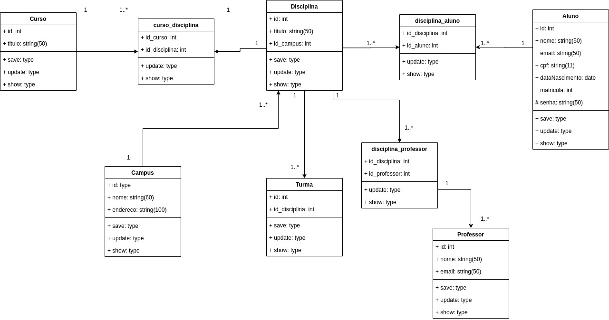

# sistema-matricula
Um sistema de matricula de alunos desenvolvido com react.

* **Database**:
``docker run --name universidade-postgres -e POSTGRES_USER=docker -e POSTGRES_DB=universidade -e POSTGRES_PASSWORD=docker -p 5432:5432 -d postgres``
 

* **Create database and tables:**
``npx sequelize db:migrate``
 

* **Run seeds (add default data):**
``npx sequelize db:seed:all``
 

* **Diagram:**

  

